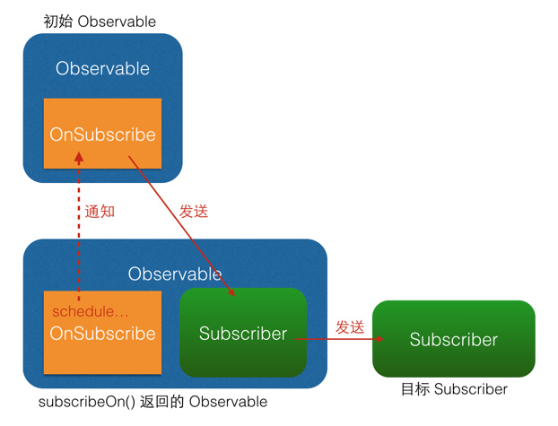
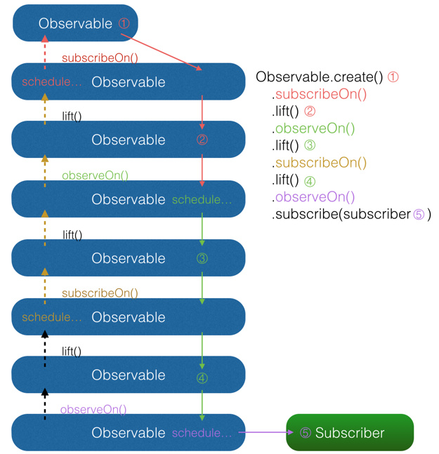

[原文地址](http://www.daidingkang.cc/2017/05/19/Rxjava/)

### 一、前言

RxJava等编程思想正在Android开发者中变的越来越流行。唯一的问题就是上手不容易，尤其是大部分人之前都是使用命令式编程语言。

首先要先理清这么一个问题：Rxjava和我们平时写的程序有什么不同。相信稍微对Rxjava有点认知的朋友都会深深感受到用这种方式写的程序和我们一般写的程序有很明显的不同。我们一般写的程序 统称为命令式程序，是以流程为核心的，每一行代码实际上都是机器实际上要执行的指令。而Rxjava这样的编程风格，称为函数响应式编程。函数响应式编程是以数据流为核心，处理数据的输入，处理以及输出的。这种思路写出来的代码就会跟机器实际执行的指令大相径庭。所以对于已经习惯命令式编程的我们来说，刚开始接触Rxjava的时候必然会很不适应，而且也不太符合我们平时的思维习惯。但是久而久之你会发现这个框架的精髓，尤其是你运用到大项目中的时候，简直爱不释手，随着程序逻辑变得越来越复杂，它依然能够保持代码简洁。


### 二、RxJava是什么

>a library for composing asynchronous and event-based programs using observable sequences for the Java VM
 解释：一个对于构成使用的Java虚拟机观察序列异步和基于事件的程序库

 RxJava 是一个响应式编程框架，采用观察者设计模式。所以自然少不了 Observable 和 Subscriber 这两个东东了。
 RxJava 是一个开源项目，地址：https://github.com/ReactiveX/RxJava
 RxAndroid，用于 Android 开发，添加了 Android 用的接口。地址： https://github.com/ReactiveX/RxAndroid

### 三、基本概念

网上关于RxJava的博文也有很多，我也看过许多，其中不乏有优秀的文章，但绝大部分文章都有一个共同点，就是侧重于讲RxJava中各种强大的操作符，而忽略了最基本的东西——概念，所以一开始我也看的一脸懵逼，看到后面又忘了前面的，脑子里全是问号，这个是什么，那个又是什么，这两个长得怎么那么像。举个不太恰当的例子，概念之于初学者，就像食物之于人，当你饿了，你会想吃面包、牛奶，那你为什么不去吃土呢，因为你知道面包牛奶是用来干嘛的，土是用来干嘛的。同理，前面已经说过，RxJava无非是发送数据与接收数据，那么什么是发射源，什么是接收源，这就是你应该明确的事，也是RxJava的入门条件之一，下面就依我个人理解，对发射源和接收源做个归类，以及RxJava中频繁出现的几个“单词”解释一通;

#### 1、Observable：发射源，英文释义“可观察的”，在观察者模式中称为“被观察者”或“可观察对象”；

#### 2、Observer：接收源，英文释义“观察者”，没错！就是观察者模式中的“观察者”，可接收Observable、Subject发射的数据；

```java
public interface Observer<T> {
    void onCompleted();
    void onError(Throwable e);
    void onNext(T t);
}
```

#### 3、Subscription ：Observable调用subscribe( )方法返回的对象，同样有unsubscribe( )方法，可以用来取消订阅事件；

```java
public interface Subscription {
    void unsubscribe();
    boolean isUnsubscribed();
}
```

#### 4、Subscriber：“订阅者”，也是接收源，那它跟Observer有什么区别呢？Subscriber实现了Observer接口，比Observer多了一个最重要的方法unsubscribe( )，用来取消订阅，当你不再想接收数据了，可以调用unsubscribe( )方法停止接收，Observer 在 subscribe() 过程中,最终也会被转换成 Subscriber 对象，一般情况下，建议使用Subscriber作为接收源；

```java
public abstract class Subscriber<T> implements Observer<T>, Subscription {}
```

#### 3、Subject：Subject是一个比较特殊的对象，既可充当发射源，也可充当接收源，为避免初学者被混淆，本章将不对Subject做过多的解释和使用，重点放在Observable和Observer上，先把最基本方法的使用学会，后面再学其他的都不是什么问题；

```java
public abstract class Subject<T, R> extends Observable<R> implements Observer<T> {}
```

#### 6、Action0：RxJava中的一个接口，它只有一个无参call（）方法，且无返回值，同样还有Action1，Action2…Action9等，Action1封装了含有 1 个参的call（）方法，即call（T t），Action2封装了含有 2 个参数的call方法，即call（T1 t1，T2 t2），以此类推；

```java

public interface Action0 extends Action {
    void call();
}

public interface Action extends Function {

}

public interface Function {

}
```

#### 7、Func0：与Action0非常相似，也有call（）方法，但是它是有返回值的，同样也有Func0、Func1…Func9;

```java
public interface Func0<R> extends Function, Callable<R> {
    @Override
    R call();
}

public interface Function {

}

@FunctionalInterface
public interface Callable<V> {
    /**
     * Computes a result, or throws an exception if unable to do so.
     *
     * @return computed result
     * @throws Exception if unable to compute a result
     */
    V call() throws Exception;
}
```


RxJava最核心的两个东西是Observables（被观察者，事件源）和Subscribers（观察者）。Observables发出一系列事件，Subscribers处理这些事件。这里的事件可以是任何你感兴趣的东西（触摸事件，web接口调用返回的数据…）

一个Observable可以发出零个或者多个事件，知道结束或者出错。每发出一个事件，就会调用它的Subscriber的onNext方法，最后调用Subscriber.onNext()或者Subscriber.onError()结束。

Rxjava的看起来很想设计模式中的观察者模式，但是有一点明显不同，那就是如果一个Observerble没有任何的的Subscriber，那么这个Observable是不会发出任何事件的。

### 四、基本用法

#### 1、Observable的创建

使用create( ),最基本的创建方式：

```java
Observable<String>  myObservable  = Observable.create(new Observable.OnSubscribe<String>() {
  @Override
  public void call(Subscriber<? super String> subscriber) {
      subscriber.onNext("Hello, world!"); //发射一个"Hello, world!"的String
      subscriber.onCompleted();//发射完成,这种方法需要手动调用onCompleted，才会回调Observer的onCompleted方法
  }});
```


可以看到，这里传入了一个 OnSubscribe 对象作为参数。OnSubscribe 会被存储在返回的 Observable 对象中，它的作用相当于一个计划表，当 Observable 被订阅的时候，OnSubscribe 的 call() 方法会自动被调用，事件序列就会依照设定依次触发（对于上面的代码，就是观察者Subscriber将会被调用一次 onNext() 和一次 onCompleted()）。这样，由被观察者调用了观察者的回调方法，就实现了由被观察者向观察者的事件传递，即观察者模式。

这个例子很简单：事件的内容是字符串，而不是一些复杂的对象；事件的内容是已经定好了的，而不像有的观察者模式一样是待确定的（例如网络请求的结果在请求返回之前是未知的）；所有事件在一瞬间被全部发送出去，而不是夹杂一些确定或不确定的时间间隔或者经过某种触发器来触发的。总之，这个例子看起来毫无实用价值。但这是为了便于说明，实质上只要你想，各种各样的事件发送规则你都可以自己来写。至于具体怎么做，后面都会讲到，但现在不行。只有把基础原理先说明白了，上层的运用才能更容易说清楚。

#### 2、Subscriber的创建

上面定义的Observable对象仅仅发出一个Hello World字符串，然后就结束了。接着我们创建一个Subscriber来处理Observable对象发出的字符串：

```java
Subscriber<String> mySubscriber = new Subscriber<String>() {


    @Override
    public void onCompleted() {
        Log.d("mySubscriber", "onCompleted: 被执行");
    }

    @Override
    public void onError(Throwable e) {

    }

    @Override
    public void onNext(String s) {
        Log.d("mySubscriber", "onNext: 被执行"+s);
    }
};

```

除了 Observer 接口之外，RxJava 还内置了一个实现了 Observer 的抽象类：Subscriber。 Subscriber 对 Observer 接口进行了一些扩展，但他们的基本使用方式是完全一样的：

```java
Observer<String> myObserver = new Observer<String>() {
    @Override
    public void onCompleted() {
        Log.d("myObserver", "onCompleted: 被执行");
    }

    @Override
    public void onError(Throwable e) {

    }

    @Override
    public void onNext(String s) {
        Log.d("myObserver", "onNext: 被执行"+s);
    }
};
```

不仅基本使用方式一样，实质上，在 RxJava 的 subscribe 过程中，Observer 也总是会先被转换成一个 Subscriber 再使用。所以如果你只想使用基本功能，选择 Observer 和 Subscriber 是完全一样的。它们的区别对于使用者来说主要有两点：

1.onStart(): 这是 Subscriber 增加的方法。它会在 subscribe 刚开始，而事件还未发送之前被调用，可以用于做一些准备工作，例如数据的清零或重置。这是一个可选方法，默认情况下它的实现为空。需要注意的是，如果对准备工作的线程有要求（例如弹出一个显示进度的对话框，这必须在主线程执行），onStart() 就不适用了，因为它总是在 subscribe 所发生的线程被调用，而不能指定线程。要在指定的线程来做准备工作，可以使用 doOnSubscribe() 方法，具体可以在后面的文中看到。

2.unsubscribe(): 这是 Subscriber 所实现的另一个接口 Subscription 的方法，用于取消订阅。在这个方法被调用后，Subscriber 将不再接收事件。一般在这个方法调用前，可以使用 isUnsubscribed() 先判断一下状态。 unsubscribe() 这个方法很重要，因为在 subscribe() 之后， Observable 会持有 Subscriber 的引用，这个引用如果不能及时被释放，将有内存泄露的风险。所以最好保持一个原则：要在不再使用的时候尽快在合适的地方（例如 onPause() onStop() 等方法中）调用 unsubscribe() 来解除引用关系，以避免内存泄露的发生。

#### 3、Observable与Subscriber的关联

这里subscriber仅仅就是打印observable发出的字符串。通过subscribe函数就可以将我们定义的myObservable对象和mySubscriber对象关联起来，这样就完成了subscriber对observable的订阅。

```java
myObservable.subscribe(myObserver);
// 或者：
myObservable.subscribe(mySubscriber);
```

一旦mySubscriber订阅了myObservable，myObservable就是调用mySubscriber对象的onNext和onComplete方法，mySubscriber 就会打印出Hello World！

#### 4、订阅（Subscriptions）

当调用Observable.subscribe()，会返回一个Subscription对象。这个对象代表了被观察者和订阅者之间的联系。

```java
Subscription subscription = Observable.just("Hello, World!")
    .subscribe(s -> System.out.println(s));
```

你可以在后面使用这个Subscription对象来操作被观察者和订阅者之间的联系.

```java
subscription.unsubscribe();//解除订阅关系
System.out.println("Unsubscribed=" + subscription.isUnsubscribed());
// Outputs "Unsubscribed=true"
```

RxJava的另外一个好处就是它处理unsubscribing的时候，会停止整个调用链。如果你使用了一串很复杂的操作符，调用unsubscribe将会在他当前执行的地方终止。不需要做任何额外的工作！

### 简化代码（Observable与Subscriber）

#### 简化Observable：

是不是觉得仅仅为了打印一个hello world要写这么多代码太啰嗦？我这里主要是为了展示RxJava背后的原理而采用了这种比较啰嗦的写法，RxJava其实提供了很多便捷的函数来帮助我们减少代码。

首先来看看如何简化Observable对象的创建过程。RxJava内置了很多简化创建Observable对象的函数，比如Observable.just就是用来创建只发出一个事件就结束的Observable对象，上面创建Observable对象的代码可以简化为一行：

```java
Observable<String> myObservable = Observable.just("Hello, world!"); //发送"Hello, world!"
```

其他方法：

1.使用just( )，将为你创建一个Observable并自动为你调用onNext( )发射数据：

```java
justObservable = Observable.just("just1","just2");//依次发送"just1"和"just2"
```

2.使用from( )，遍历集合，发送每个item：

```java
List<String> list = new ArrayList<>();
list.add("from1");
list.add("from2");
list.add("from3");
fromObservable = Observable.from(list);  //遍历list 每次发送一个
/** 注意，just()方法也可以传list，但是发送的是整个list对象，而from（）发送的是list的一个item** /
```

3.使用defer( )，有观察者订阅时才创建Observable，并且为每个观察者创建一个新的Observable：

```java
deferObservable = Observable.defer(new Func0<Observable<String>>() {
  @Override
  //注意此处的call方法没有Subscriber参数
  public Observable<String> call() {
      return Observable.just("deferObservable");
  }});
```

4.使用interval( ),创建一个按固定时间间隔发射整数序列的Observable，可用作定时器：

```java
intervalObservable = Observable.interval(1, TimeUnit.SECONDS);//每隔一秒发送一次
```

5.使用range( ),创建一个发射特定整数序列的Observable，第一个参数为起始值，第二个为发送的个数，如果为0则不发送，负数则抛异常：

```java
rangeObservable = Observable.range(10, 5);//将发送整数10，11，12，13，14
```

6.使用timer( ),创建一个Observable，它在一个给定的延迟后发射一个特殊的值，等同于Android中Handler的postDelay( )方法：

```java
timeObservable = Observable.timer(3, TimeUnit.SECONDS);  //3秒后发射一个值
```

7.使用repeat( ),创建一个重复发射特定数据的Observable:

```java
repeatObservable = Observable.just("repeatObservable").repeat(3);//重复发射3次
```

#### 简化Subscriber：

接下来看看如何简化Subscriber，上面的例子中，我们其实并不关心OnComplete和OnError，我们只需要在onNext的时候做一些处理，这时候就可以使用Action1类。

```java
Action1<String> onNextAction = new Action1<String>() {
    @Override
    public void call(String s) {
        System.out.println(s);
    }
};
```

subscribe方法有一个重载版本，接受三个Action1类型的参数，分别对应OnNext，OnComplete， OnError函数:

```java
myObservable.subscribe(onNextAction, onErrorAction, onCompleteAction);
```

这里我们并不关心onError和onComplete，所以只需要第一个参数就可以

```java
myObservable.subscribe(onNextAction);
// Outputs "Hello, world!"
```

上面的代码最终可以写成这样:

```java
Observable.just("Hello, world!")
    .subscribe(new Action1<String>() {
        @Override
        public void call(String s) {
              System.out.println(s);
        }
    });
```

使用java8的lambda可以使代码更简洁:

>不熟悉Lambda的可以看我之前写的：[Java8之Lambda表达式(Android用法)](http://www.daidingkang.cc/2017/05/11/java8-Lambda/)

```java

Observable.just("Hello, world!")
    .subscribe(s -> System.out.println(s));

```

简单解释一下这段代码中出现的 Action1 和 Action0。 Action0 是 RxJava 的一个接口，它只有一个方法 call()，这个方法是无参无返回值的；由于 onCompleted() 方法也是无参无返回值的，因此 Action0 可以被当成一个包装对象，将 onCompleted() 的内容打包起来将自己作为一个参数传入 subscribe() 以实现不完整定义的回调。这样其实也可以看做将onCompleted() 方法作为参数传进了 subscribe()，相当于其他某些语言中的『闭包』。 Action1 也是一个接口，它同样只有一个方法 call(T param)，这个方法也无返回值，但有一个参数；与 Action0 同理，由于 onNext(T obj) 和 onError(Throwable error)也是单参数无返回值的，因此 Action1 可以将 onNext(obj) 和 onError(error) 打包起来传入 subscribe() 以实现不完整定义的回调。事实上，虽然 Action0 和 Action1 在 API 中使用最广泛，但 RxJava 是提供了多个 ActionX 形式的接口 (例如 Action2, Action3) 的，它们可以被用以包装不同的无返回值的方法。

注：正如前面所提到的，Observer 和 Subscriber 具有相同的角色，而且 Observer 在 subscribe() 过程中最终会被转换成 Subscriber 对象，因此，从这里开始，后面的描述我将用 Subscriber 来代替 Observer ，这样更加严谨。

#### 操作符(Operators)

操作符就是为了解决对Observable对象的 变换(关键词) 的问题，操作符用于在Observable和最终的Subscriber之间修改Observable发出的事件。RxJava提供了很多很有用的操作符。
比如map操作符，就是用来把把一个事件转换为另一个事件的。


##### map()操作符：

```java
Observable.just(R.mipmap.ic_launcher) // 输入类型 String
        .map(new Func1<Integer, Bitmap>() {
            @Override
            public Bitmap call(Integer filePath) { // 参数类型 String
                return getBitmapFromPath(filePath); // 返回类型 Bitmap
            }
        })
        .subscribe(new Action1<Bitmap>() {
            @Override
            public void call(Bitmap bitmap) { // 参数类型 Bitmap
                showBitmap(bitmap);
            }
        });
```

使用lambda可以简化为:

```java
        Observable.just(R.mipmap.ic_launcher_round)//输入类型整数型
                .map( resID -> getBitmapFromPath(resID))
                .subscribe(bitmap -> showBitmap(bitmap));
```

可以看到，map() 方法将参数中的 String 对象转换成一个 Bitmap 对象后返回，而在经过 map() 方法后，事件的参数类型也由 String 转为了 Bitmap。这种直接变换对象并返回的，是最常见的也最容易理解的变换。不过 RxJava 的变换远不止这样，它不仅可以针对事件对象，还可以针对整个事件队列，这使得 RxJava 变得非常灵活。

map()操作符进阶：

```java
Observable.just("Hello, world!")
    .map(s -> s.hashCode())
    .map(i -> Integer.toString(i))
    .subscribe(s -> System.out.println(s));

```

是不是很酷？map()操作符就是用于变换Observable对象的，map操作符返回一个Observable对象，这样就可以实现链式调用，在一个Observable对象上多次使用map操作符，最终将最简洁的数据传递给Subscriber对象。

##### flatMap()操作符：

假设我有这样一个方法：
这个方法根据输入的字符串返回一个网站的url列表

```java
Observable<List<String>> query();
```

```java
query()
    .flatMap(new Func1<List<String>, Observable<String>>() {
        @Override
        public Observable<String> call(List<String> urls) {
            return Observable.from(urls);
        }
    })
    .subscribe(url -> System.out.println(url));
```

这里我贴出了整个的函数代码，以方便你了解发生了什么，使用lambda可以大大简化代码长度：

```java
        //使Lambda和flatMap
        query().flatMap(list -> Observable.from(list))
                .subscribe(url -> Log.d("just", "flatMap: 被执行++++" + url));
```

flatMap()是不是看起来很奇怪？为什么它要返回另外一个Observable呢？理解flatMap的关键点在于，flatMap输出的新的Observable正是我们在Subscriber想要接收的。现在Subscriber不再收到List<String>，而是收到一些列单个的字符串，就像Observable.from()的输出一样。

flatMap() 和map()有一个相同点：它也是把传入的参数转化之后返回另一个对象。但需要注意，和 map() 不同的是， flatMap() 中返回的是个 Observable 对象，并且这个 Observable 对象并不是被直接发送到了 Subscriber 的回调方法中。flatMap() 的原理是这样的：

1.使用传入的事件对象创建一个 Observable 对象；
2.并不发送这个 Observable, 而是将它激活，于是它开始发送事件；
3.每一个创建出来的 Observable 发送的事件，都被汇入同一个 Observable ，而这个 Observable 负责将这些事件统一交给 Subscriber 的回调方法。这三个步骤，把事件拆成了两级，通过一组新创建的 Observable 将初始的对象『铺平』之后通过统一路径分发了下去。而这个『铺平』就是 flatMap() 所谓的 flat。

值得注意的是.from()是Observable创建时候用的，.flatMap()才是操作符；

其他操作符：

目前为止，我们已经接触了两个操作符，RxJava中还有更多的操作符，那么我们如何使用其他的操作符来改进我们的代码呢？

> 更多RxJava的操作符请查看：[RxJava操作符大全](http://blog.csdn.net/maplejaw_/article/details/52396175)

我们不想输出”url03”，那么我们可以从返回的title列表中过滤掉null值！

```java
        //使用filter对数据进行过滤
        query().flatMap(list -> Observable.from(list))
                .filter(s -> s != "url03")
                .subscribe(url -> Log.d("just", "Filter: 被执行++++" +url));
```

filter()输出和输入相同的元素，并且会过滤掉那些不满足检查条件的。

如果我们只想要最多5个结果：

```java
        //使用take限制输出数量
        query().flatMap(list -> Observable.from(list))
                .take(5)
                .subscribe(url -> Log.d("just", "Filter: 被执行++++" + url));
```

take()输出最多指定数量的结果。

如果我们想在打印之前，做一些其他事情：

```java
        //doOnNext()允许我们在每次输出一个元素之前做一些额外的事情
        query().flatMap(list -> Observable.from(list))
                .doOnNext(url -> Log.d("just", "doOnNext: 被执行++++" + url))
                .subscribe(url -> Log.d("just", "doOnNext_subscribe: 被执行++++" + url));
```

doOnNext()允许我们在每次输出一个元素之前做一些额外的事情，比如这里。

看到这里操作数据流是多么简单了么。你可以添加任意多的操作，并且不会搞乱你的代码。

RxJava包含了大量的操作符。操作符的数量是有点吓人，但是很值得你去挨个看一下，这样你可以知道有哪些操作符可以使用。弄懂这些操作符可能会花一些时间，但是一旦弄懂了，你就完全掌握了RxJava的威力。

感觉如何？

好吧，你是一个怀疑主义者，并且还很难被说服，那为什么你要关心这些操作符呢？

因为操作符可以让你对数据流做任何操作。

将一系列的操作符链接起来就可以完成复杂的逻辑。代码被分解成一系列可以组合的片段。这就是**响应式函数编程**的魅力。用的越多，就会越多的改变你的编程思维。


#### 线程控制(Scheduler)

假设你编写的Android app需要从网络请求数据。网络请求需要花费较长的时间，因此你打算在另外一个线程中加载数据。那么问题来了！

编写多线程的Android应用程序是很难的，因为你必须确保代码在正确的线程中运行，否则的话可能会导致app崩溃。最常见的就是在非主线程更新UI。

在不指定线程的情况下， RxJava 遵循的是线程不变的原则，即：在哪个线程调用 subscribe()，就在哪个线程生产事件；在哪个线程生产事件，就在哪个线程消费事件。如果需要切换线程，就需要用到 Scheduler （调度器）。

使用RxJava，你可以使用subscribeOn()指定观察者代码运行的线程，使用observerOn()指定订阅者运行的线程

##### Scheduler 的 API

在RxJava 中，Scheduler ——调度器，相当于线程控制器，RxJava 通过它来指定每一段代码应该运行在什么样的线程。RxJava 已经内置了几个 Scheduler ，它们已经适合大多数的使用场景：

1.Schedulers.immediate(): 直接在当前线程运行，相当于不指定线程。这是默认的 Scheduler。

2.Schedulers.newThread(): 总是启用新线程，并在新线程执行操作。

3.Schedulers.io(): I/O 操作（读写文件、读写数据库、网络信息交互等）所使用的 Scheduler。行为模式和 newThread() 差不多，区别在于 io() 的内部实现是是用一个无数量上限的线程池，可以重用空闲的线程，因此多数情况下 io() 比 newThread() 更有效率。不要把计算工作放在 io() 中，可以避免创建不必要的线程。

4.Schedulers.computation(): 计算所使用的 Scheduler。这个计算指的是 CPU 密集型计算，即不会被 I/O 等操作限制性能的操作，例如图形的计算。这个 Scheduler 使用的固定的线程池，大小为 CPU 核数。不要把 I/O 操作放在 computation() 中，否则 I/O 操作的等待时间会浪费 CPU。

5.另外， Android 还有一个专用的 AndroidSchedulers.mainThread()，它指定的操作将在 Android 主线程运行。

有了以上这几个 Scheduler ，就可以使用 subscribeOn() 和 observeOn() 两个方法来对线程进行控制了。

- subscribeOn(): 指定 subscribe() 所发生的线程，即 Observable.OnSubscribe 被激活时所处的线程。或者叫做事件产生的线程。

- observeOn(): 指定 Subscriber 所运行在的线程。或者叫做事件消费的线程。

注意：observeOn() 指定的是 Subscriber 的线程，而这个 Subscriber 并不一定是 subscribe() 参数中的 Subscriber（这块参考RxJava变换部分），而是 observeOn() 执行时的当前 Observable 所对应的 Subscriber ，即它的直接下级 Subscriber 。

换句话说，observeOn() 指定的是它之后的操作所在的线程。因此如果有多次切换线程的需求，只要在每个想要切换线程的位置调用一次 observeOn() 即可。

代码示例：

```java
Observable.just(1, 2, 3, 4)
    .subscribeOn(Schedulers.io()) // 指定 subscribe() 发生在 IO 线程
    .observeOn(AndroidSchedulers.mainThread()) // 指定 Subscriber 的回调发生在主线程
    .subscribe(new Action1<Integer>() {
        @Override
        public void call(Integer number) {
            Log.d(tag, "number:" + number);
        }
    });
```

上面这段代码中，由于 subscribeOn(Schedulers.io()) 的指定，被创建的事件的内容 1、2、3、4 将会在 IO 线程发出；
而由于 observeOn(AndroidScheculers.mainThread()) 的指定，因此 subscriber 数字的打印将发生在主线程 。
事实上，这种在 subscribe() 之前写上两句subscribeOn(Scheduler.io()) 和 observeOn(AndroidSchedulers.mainThread()) 的使用方式非常常见，它适用于多数的 『后台线程取数据，主线程显示』的程序策略。

下面的实例，在Observable.OnSubscribe的call()中模拟了长时间获取数据过程，在Subscriber的noNext()中显示数据到UI。

```java
Observable.create(new Observable.OnSubscribe<String>() {
    @Override
    public void call(Subscriber<? super String> subscriber) {

        Log.d("test13_scheduler02", "被观察者所在的前线程名称：:" + Thread.currentThread().getName());

        subscriber.onNext("info1");

        SystemClock.sleep(2000);
        subscriber.onNext("info2-sleep 2s");

        SystemClock.sleep(3000);
        subscriber.onNext("info2-sleep 3s");

        SystemClock.sleep(5000);
        subscriber.onCompleted();
    }
})
        .subscribeOn(Schedulers.io()) //指定 subscribe() 发生在 IO 线程
        .observeOn(AndroidSchedulers.mainThread()) //指定 Subscriber 的回调发生在主线程
        .subscribe(new Subscriber<String>() {
            @Override
            public void onCompleted() {
                Log.d("test13_scheduler02", "onCompleted()+当前线程名称：" + Thread.currentThread().getName());
            }

            @Override
            public void onError(Throwable e) {
                Log.v("test13_scheduler02", "onError() e=" + e);
            }

            @Override
            public void onNext(String s) {
                Log.d("test13_scheduler02", "onNext()+当前线程名称：:" + Thread.currentThread().getName());
                mainView.showMsg(s);
            }
        });
```

至此，我们可以看到call()将会发生在 IO 线程，而showInfo(s)则被设定在了主线程。这就意味着，即使加载call()耗费了几十甚至几百毫秒的时间，也不会造成丝毫界面的卡顿。

#### 值得注意：subscribeOn () 与 observeOn()都会返回了一个新的Observable，因此若不是采用上面这种直接流方式，而是分步调用方式，需要将新返回的Observable赋给原来的Observable，否则线程调度将不会起作用。


使用下面方式，最后发现“OnSubscribe”还是在默认线程中运行；原因是subscribeOn这类操作后，返回的是一个新的Observable。

```java
observable.subscribeOn(Schedulers.io());
observable.observeOn(AndroidSchedulers.mainThread());
observable .subscribe(subscribe);
```

可以修改为下面两种方式：

```java
observable = observable.subscribeOn(Schedulers.io());
observable = observable.observeOn(AndroidSchedulers.mainThread());
observable .subscribe(subscribe);
//OR
observable.subscribeOn(Schedulers.io())
.observeOn(AndroidSchedulers.mainThread())
.subscribe(subscribe);
```

前面讲到了，可以利用 subscribeOn() 结合 observeOn() 来实现线程控制，让事件的产生和消费发生在不同的线程。可是在了解了 map() flatMap() 等变换方法后，有些好事的（其实就是当初刚接触 RxJava 时的我）就问了：能不能多切换几次线程？

答案是：能。
因为 observeOn() 指定的是 Subscriber 的线程，而这个 Subscriber 并不是（严格说应该为『不一定是』，但这里不妨理解为『不是』）subscribe() 参数中的 Subscriber ，而是 observeOn() 执行时的当前 Observable 所对应的 Subscriber ，即它的直接下级 Subscriber 。换句话说，observeOn() 指定的是它之后的操作所在的线程。因此如果有多次切换线程的需求，只要在每个想要切换线程的位置调用一次 observeOn() 即可。上代码：

```java
Observable.just(1, 2, 3, 4) // IO 线程，由 subscribeOn() 指定
    .subscribeOn(Schedulers.io())
    .observeOn(Schedulers.newThread())
    .map(mapOperator) // 新线程，由 observeOn() 指定
    .observeOn(Schedulers.io())
    .map(mapOperator2) // IO 线程，由 observeOn() 指定
    .observeOn(AndroidSchedulers.mainThread)
    .subscribe(subscriber);  // Android 主线程，由 observeOn() 指定

```

如上，通过 observeOn() 的多次调用，程序实现了线程的多次切换。

不过，不同于 observeOn() ， subscribeOn() 的位置放在哪里都可以，但它是只能调用一次的。

又有好事的（其实还是当初的我）问了：如果我非要调用多次 subscribeOn() 呢？会有什么效果？

这个问题先放着，我们还是从 RxJava 线程控制的原理说起吧。

#### Scheduler 的原理

其实， subscribeOn() 和 observeOn() 的内部实现，也是用的 lift()。具体看图（不同颜色的箭头表示不同的线程）：

subscribeOn()原理图：



observeOn() 原理图：


从图中可以看出，subscribeOn() 和 observeOn() 都做了线程切换的工作（图中的 “schedule…” 部位）。不同的是， subscribeOn() 的线程切换发生在 OnSubscribe 中，即在它通知上一级 OnSubscribe 时，这时事件还没有开始发送，因此 subscribeOn() 的线程控制可以从事件发出的开端就造成影响；而 observeOn() 的线程切换则发生在它内建的 Subscriber 中，即发生在它即将给下一级 Subscriber 发送事件时，因此 observeOn() 控制的是它后面的线程。

最后，我用一张图来解释当多个 subscribeOn() 和 observeOn() 混合使用时，线程调度是怎么发生的（由于图中对象较多，相对于上面的图对结构做了一些简化调整）：



图中共有 5 处含有对事件的操作。由图中可以看出，①和②两处受第一个 subscribeOn() 影响，运行在红色线程；③和④处受第一个 observeOn() 的影响，运行在绿色线程；⑤处受第二个 onserveOn() 影响，运行在紫色线程；而第二个 subscribeOn() ，由于在通知过程中线程就被第一个 subscribeOn() 截断，因此对整个流程并没有任何影响。这里也就回答了前面的问题：当使用了多个 subscribeOn() 的时候，只有第一个 subscribeOn() 起作用。

#### 延伸：doOnSubscribe()

> doOnSubscribe()一般用于执行一些初始化操作.

然而，虽然超过一个的 subscribeOn() 对事件处理的流程没有影响，但在流程之前却是可以利用的。

在前面讲 Subscriber 的时候，提到过 Subscriber 的 onStart() 可以用作流程开始前的初始化。然而 onStart() 由于在 subscribe() 发生时就被调用了，因此不能指定线程，而是只能执行在 subscribe() 被调用时的线程。这就导致如果 onStart() 中含有对线程有要求的代码（例如在界面上显示一个 ProgressBar，这必须在主线程执行），将会有线程非法的风险，因为有时你无法预测 subscribe() 将会在什么线程执行。

而与 Subscriber.onStart() 相对应的，有一个方法 Observable.doOnSubscribe() 。它和 Subscriber.onStart() 同样是在 subscribe() 调用后而且在事件发送前执行，但区别在于它可以指定线程。默认情况下， doOnSubscribe() 执行在 subscribe() 发生的线程；而如果在 doOnSubscribe() 之后有 subscribeOn() 的话，它将执行在离它最近的 subscribeOn() 所指定的线程。

示例：

```java
Observable.create(onSubscribe)
    .subscribeOn(Schedulers.io())
    .doOnSubscribe(new Action0() {
        @Override
        public void call() {
            progressBar.setVisibility(View.VISIBLE); // 需要在主线程执行
        }
    })
    .subscribeOn(AndroidSchedulers.mainThread()) // 指定主线程
    .observeOn(AndroidSchedulers.mainThread())
    .subscribe(subscriber);
```

如上，在 doOnSubscribe() 的后面跟一个 subscribeOn() ，就能指定准备工作的线程了。

### RxJava 的适用场景和使用方式

#### RxJava + Retrofit

>Retrofit 是 Square 的一个著名的网络请求库。对于Retrofit不了解的同学
 可以参考我之前写的文章：[全新的网络加载框架Retrofit2，上位的小三](https://www.daidingkang.cc/2016/06/17/Retrofit2-network-framework-parsing/)

Retrofit 除了提供了传统的 Callback 形式的 API，还有 RxJava 版本的 Observable 形式 API。下面我用对比的方式来介绍 Retrofit 的 RxJava 版 API 和传统版本的区别。

以获取一个 MovieEntity 对象的接口作为例子。使用Retrofit 的传统 API，你可以用这样的方式来定义请求：

```java

@GET("top250")
Call<MovieEntity> getTopMovie(@Query("start") int start, @Query("count") int count);//正常返回Call对象

```

我们来写getMovie方法的代码:

```java
//进行网络请求
private void getMovie(){
    String baseUrl = "https://api.douban.com/v2/movie/";

    Retrofit retrofit = new Retrofit.Builder()
            .baseUrl(baseUrl)
            .addConverterFactory(GsonConverterFactory.create())
            .build();

    MovieService movieService = retrofit.create(MovieService.class);
    Call<MovieEntity> call = movieService.getTopMovie(0, 10);
    call.enqueue(new Callback<MovieEntity>() {
        @Override
        public void onResponse(Call<MovieEntity> call, Response<MovieEntity> response) {
            resultTV.setText(response.body().toString());
        }

        @Override
        public void onFailure(Call<MovieEntity> call, Throwable t) {
            resultTV.setText(t.getMessage());
        }
    });
}
```

以上为没有经过封装的、原生态的Retrofit写网络请求的代码。

而使用 RxJava 形式的 API，定义同样的请求是这样的：

```java
@GET("top250")
  Observable<MovieEntity> getTopMovie(@Query("start") int start, @Query("count") int count);//RxJava返回Observable对象
```

Retrofit本身对Rxjava提供了支持，getMovie方法改为：

```java
//进行网络请求
private void getMovie(){
    String baseUrl = "https://api.douban.com/v2/movie/";

    Retrofit retrofit = new Retrofit.Builder()
            .baseUrl(baseUrl)
            .addConverterFactory(GsonConverterFactory.create())
            .addCallAdapterFactory(RxJavaCallAdapterFactory.create())//提供RXjava支持
            .build();

    MovieService movieService = retrofit.create(MovieService.class);

    movieService.getTopMovie(0, 10)//返回Observable对象
            .subscribeOn(Schedulers.io())
            .observeOn(AndroidSchedulers.mainThread())
            .subscribe(new Subscriber<MovieEntity>() {
                @Override
                public void onCompleted() {
                    Toast.makeText(MainActivity.this, "Get Top Movie Completed", Toast.LENGTH_SHORT).show();
                }

                @Override
                public void onError(Throwable e) {
                    resultTV.setText(e.getMessage());
                }

                @Override
                public void onNext(MovieEntity movieEntity) {
                    resultTV.setText(movieEntity.toString());
                }
            });
}
```

这样基本上就完成了Retrofit和Rxjava的结合，大家可以自己进行封装；那么用上了RxJava,我们就可以用它强大的操作符来对数据进行处理和操作，各位看官可以具体去实现，我在这里不做多做赘述。

参考文章：[RxJava 与 Retrofit 结合的最佳实践](http://gank.io/post/56e80c2c677659311bed9841)

#### RxBinding

RxBinding 是 Jake Wharton 的一个开源库，它提供了一套在 Android 平台上的基于 RxJava 的 Binding API。所谓 Binding，就是类似设置 OnClickListener 、设置 TextWatcher 这样的注册绑定对象的 API。

举个设置点击监听的例子。使用 RxBinding ，可以把事件监听用这样的方法来设置：

```java
Button button = ...;
RxView.clickEvents(button) // 以 Observable 形式来反馈点击事件
    .subscribe(new Action1<ViewClickEvent>() {
        @Override
        public void call(ViewClickEvent event) {
            // Click handling
        }
    });
```

看起来除了形式变了没什么区别，实质上也是这样。甚至如果你看一下它的源码，你会发现它连实现都没什么惊喜：它的内部是直接用一个包裹着的 setOnClickListener() 来实现的。然而，仅仅这一个形式的改变，却恰好就是 RxBinding 的目的：扩展性。通过 RxBinding 把点击监听转换成 Observable 之后，就有了对它进行扩展的可能。扩展的方式有很多，根据需求而定。一个例子是前面提到过的 throttleFirst() 操作符，用于去抖动，也就是消除手抖导致的快速连环点击：

```java
RxView.clickEvents(button)
    .throttleFirst(500, TimeUnit.MILLISECONDS)
    .subscribe(clickAction);
```

如果想对 RxBinding 有更多了解，可以去它的 [GitHub 项目](https://github.com/JakeWharton/RxBinding) 下面看看。

#### RxLifecyle

RxLifecycle 配合 Activity/Fragment 生命周期来管理订阅的。 由于 RxJava Observable 订阅后（调用 subscribe 函数），一般会在后台线程执行一些操作（比如访问网络请求数据），当后台操作返回后，调用 Observer 的 onNext 等函数，然后在 更新 UI 状态。 但是后台线程请求是需要时间的，如果用户点击刷新按钮请求新的微博信息，在刷新还没有完成的时候，用户退出了当前界面返回前面的界面，这个时候刷新的 Observable 如果不取消订阅，则会导致之前的 Activity 无法被 JVM 回收导致内存泄露。 这就是 Android 里面的生命周期管理需要注意的地方，RxLifecycle 就是用来干这事的。比如下面的示例：

```java
myObservable
    .compose(RxLifecycle.bindUntilEvent(lifecycle, ActivityEvent.DESTROY))
    .subscribe();
```

这样Activity在destroy的时候就会自动取消这个observer

#### RxBus

RxBus并不是一个库，而是一种模式。相信大多数开发者都使用过EventBus或者Otto，作为事件总线通信库，如果你的项目已经加入RxJava和EventBus，不妨用RxBus代替EventBus，以减少库的依赖。RxJava也可以轻松实现事件总线，因为它们都依据于观察者模式。

拓展链接：
[用RxJava实现事件总线(Event Bus)](http://www.jianshu.com/p/ca090f6e2fe2)
[[深入RxBus]：支持Sticky事件](http://www.jianshu.com/p/71ab00a2677b)

#### RxPermission

RxPermission是基于RxJava开发的用于帮助在Android 6.0中处理运行时权限检测的框架。在Android 6.0中，系统新增了部分权限的运行时动态获取。而不再是在以前的版本中安装的时候授予权限。

拓展链接：
[使用RxPermission框架对android6.0权限进行检测](http://blog.csdn.net/hzl9966/article/details/52062658?foxhandler=RssReadRenderProcessHandler)

总结
简而言之RxJava是一个很牛逼的库，如果你的项目中还没有使用RxJava的话，建议可以尝试去集成使用；对大多数人而已RxJava是一个比较难上手的库了，不亚于Dagger的上手难度；不过当你认识学习使用过了，你就会发现RxJava的魅力所在；如果看一遍没有看懂的童鞋，建议多看几次；动手写写代码，我想信本文可以给到你们一些帮助；你们真正的体会到什么是 从入门到放弃再到不离不弃 ；这就是RxJava的魅力所在。


