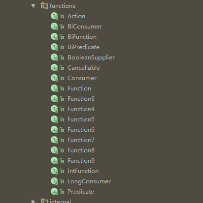
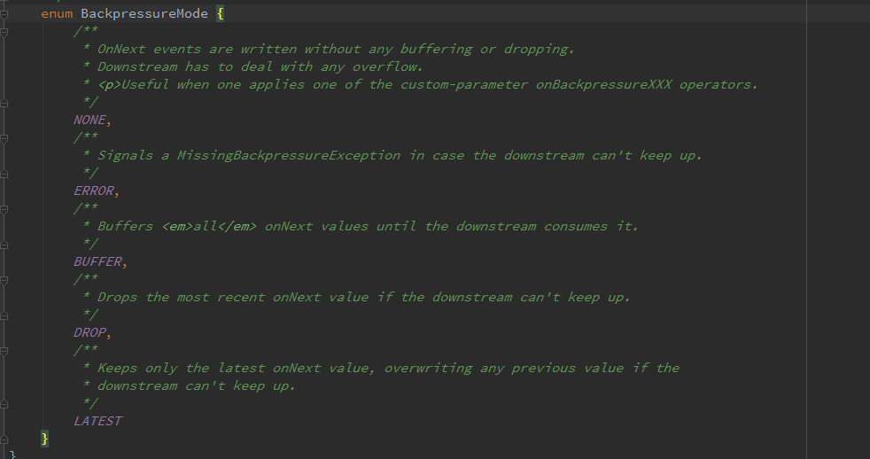

### 一、Observable

在RxJava1.x中，最熟悉的莫过于Observable这个类了，笔者刚使用RxJava2.x时，创建一个Observable后，顿时是懵逼的。因为我们熟悉的Subscriber居然没影了，取而代之的是ObservableEmitter,俗称发射器。此外，由于没有了Subscriber的踪影，我们创建观察者时需使用Observer。而Observer也不是我们熟悉的那个Observer,其回调的Disposable参数更是让人摸不到头脑。

废话不多说，从会用开始，还记得使用RxJava的三部曲吗？

#### 第一步：初始化一个Observable

```java
        //创建一个被观察者
        Observable<Integer> observable= Observable.create(new ObservableOnSubscribe<Integer>() {

            @Override
            public void subscribe(ObservableEmitter<Integer> e) throws Exception {
                Log.d("test01", "subscribe：:" + Thread.currentThread().getName());
                e.onNext(1);
                e.onNext(2);
                e.onComplete();
            }
        });
```

#### 第二步：初始化一个Observer

```java
        //创建一个观察者
        Observer<Integer> observer= new Observer<Integer>() {

            @Override
            public void onSubscribe(Disposable d) {
                Log.d("test01", "onSubscribe：:" + Thread.currentThread().getName());
            }

            @Override
            public void onNext(Integer value) {
                Log.d("test01", "onNext：:" + Thread.currentThread().getName());
            }

            @Override
            public void onError(Throwable e) {
                Log.d("test01", "onError：:" + Thread.currentThread().getName());
            }

            @Override
            public void onComplete() {
            }
        };
```

#### 第三部：建立订阅关系

```java
    observable.subscribe(observer); //建立订阅关系
```

不难看出，与RxJava1.x还是存在着一些区别的。首先，创建Observable时，回调的是ObservableEmitter,字面意思即发射器，用于发射数据（onNext）和通知（onError/onComplete）。其次，创建的Observer中多了一个回调方法onSubscribe，传递参数为Disposable ，Disposable相当于RxJava1.x中的Subscription,用于解除订阅。你可能纳闷为什么不像RxJava1.x中订阅时返回Disposable，而是选择回调出来呢。官方说是为了设计成Reactive-Streams架构。不过仔细想想这么一个场景还是很有用的，假设Observer需要在接收到异常数据项时解除订阅，在RxJava2.x中则非常简便，如下操作即可。

```java
  Observer<Integer> observer = new Observer<Integer>() {
            private Disposable disposable;

            @Override
            public void onSubscribe(Disposable d) {
                disposable = d;
            }

            @Override
            public void onNext(Integer value) {
                Log.d("JG", value.toString());
                if (value > 3) {   // >3 时为异常数据，解除订阅
                    disposable.dispose();
                }
            }

            @Override
            public void onError(Throwable e) {

            }

            @Override
            public void onComplete() {

            }
        };
```

此外，RxJava2.x中仍然保留了其他简化订阅方法，我们可以根据需求，选择相应的简化订阅。只不过传入的对象改为了Consumer。`

```java
   Disposable disposable = observable.subscribe(new Consumer<Integer>() {
            @Override
            public void accept(Integer integer) throws Exception {
                  //这里接收数据项
            }
        }, new Consumer<Throwable>() {
            @Override
            public void accept(Throwable throwable) throws Exception {
              //这里接收onError
            }
        }, new Action() {
            @Override
            public void run() throws Exception {
              //这里接收onComplete。
            }
        });
```

不同于RxJava1.x，RxJava2.x中没有了一系列的Action/Func接口，取而代之的是与Java8命名类似的函数式接口，如下图：



其中Action类似于RxJava1.x中的Action0,区别在于Action允许抛出异常。

```java
public interface Action {
    /**
     * Runs the action and optionally throws a checked exception
     * @throws Exception if the implementation wishes to throw a checked exception
     */
    void run() throws Exception;
}
```

而Consumer即消费者，用于接收单个值，BiConsumer则是接收两个值，Function用于变换对象，Predicate用于判断。这些接口命名大多参照了Java8，熟悉Java8新特性的应该都知道意思，这里也就不再赘述了。

### 二、线程调度

关于线程切换这点，RxJava1.x和RxJava2.x的实现思路是一样的。这里就简单看下相关源码。

#### subscribeOn

同RxJava1.x一样，subscribeOn用于指定subscribe()时所发生的线程,从源码角度可以看出，内部线程调度是通过ObservableSubscribeOn来实现的。

```java
   public final Observable<T> subscribeOn(Scheduler scheduler) {
        ObjectHelper.requireNonNull(scheduler, "scheduler is null");
        return RxJavaPlugins.onAssembly(new ObservableSubscribeOn<T>(this, scheduler));
    }
```

ObservableSubscribeOn的核心源码在subscribeActual方法中，通过代理的方式使用SubscribeOnObserver包装Observer后，设置Disposable来将subscribe切换到Scheduler线程中

```java
    @Override
    public void subscribeActual(final Observer<? super T> s) {
        final SubscribeOnObserver<T> parent = new SubscribeOnObserver<T>(s);

        s.onSubscribe(parent); //回调Disposable

        parent.setDisposable(scheduler.scheduleDirect(new Runnable() { //设置`Disposable`
            @Override
            public void run() {
                source.subscribe(parent); //使Observable的subscribe发生在Scheduler线程中
            }
        }));
    }
```

#### observeOn

observeOn方法用于指定下游Observer回调发生的线程。

```java
    public final Observable<T> observeOn(Scheduler scheduler, boolean delayError, int bufferSize) {
         //..
         //验证安全
        return RxJavaPlugins.onAssembly(new ObservableObserveOn<T>(this, scheduler, delayError, bufferSize));
    }
```

主要实现在ObservableObserveOn中的subscribeActual,可以看出，不同于subscribeOn,没有将suncribe操作全部切换到Scheduler中，而是通过ObserveOnSubscriber与Scheduler配合，通过schedule()达到切换下游Observer回调发生的线程，这一点与RxJava1.x实现几乎相同。关于ObserveOnSubscriber的源码这里不再重复描述了，有兴趣的可以查看本人RxJava源码解读这篇文章

```java
   @Override
    protected void subscribeActual(Observer<? super T> observer) {
        if (scheduler instanceof TrampolineScheduler) {
            source.subscribe(observer);
        } else {
            Scheduler.Worker w = scheduler.createWorker();

            source.subscribe(new ObserveOnSubscriber<T>(observer, w, delayError, bufferSize));
        }
    }
```

#### observeOn

observeOn方法用于指定下游Observer回调发生的线程。

```java
    public final Observable<T> observeOn(Scheduler scheduler, boolean delayError, int bufferSize) {
         //..
         //验证安全
        return RxJavaPlugins.onAssembly(new ObservableObserveOn<T>(this, scheduler, delayError, bufferSize));
    }
```

主要实现在ObservableObserveOn中的subscribeActual,可以看出，不同于subscribeOn,没有将suncribe操作全部切换到Scheduler中，而是通过ObserveOnSubscriber与Scheduler配合，通过schedule()达到切换下游Observer回调发生的线程，这一点与RxJava1.x实现几乎相同。关于ObserveOnSubscriber的源码这里不再重复描述了，有兴趣的可以查看本人[RxJava源码解读这篇文章](http://blog.csdn.net/maplejaw_/article/details/52381395)

```java
    @Override
    protected void subscribeActual(Observer<? super T> observer) {
        if (scheduler instanceof TrampolineScheduler) {
            source.subscribe(observer);
        } else {
            Scheduler.Worker w = scheduler.createWorker();

            source.subscribe(new ObserveOnSubscriber<T>(observer, w, delayError, bufferSize));
        }
    }
```

### Flowable

Flowable是RxJava2.x中新增的类，专门用于应对背压（Backpressure）问题，但这并不是RxJava2.x中新引入的概念。所谓背压，即生产者的速度大于消费者的速度带来的问题，比如在Android中常见的点击事件，点击过快则会造成点击两次的效果。
我们知道，在RxJava1.x中背压控制是由Observable完成的，使用如下：

```java
  Observable.range(1,10000)
            .onBackpressureDrop()
            .subscribe(integer -> Log.d("JG",integer.toString()));
```

而在RxJava2.x中将其独立了出来，取名为Flowable。因此，原先的Observable已经不具备背压处理能力。
通过Flowable我们可以自定义背压处理策略。



测试Flowable例子如下：

```java
        Flowable.create(new FlowableOnSubscribe<Integer>() {

            @Override
            public void subscribe(FlowableEmitter<Integer> e) throws Exception {

                for(int i=0;i<10000;i++){
                    e.onNext(i);
                }
                e.onComplete();
            }
        }, BackpressureStrategy.ERROR) //指定背压处理策略，抛出异常
                .subscribeOn(Schedulers.computation())
                .observeOn(Schedulers.newThread())
                .subscribe(new Consumer<Integer>() {
                    @Override
                    public void accept(Integer integer) throws Exception {
                        Log.d("JG", integer.toString());
                        Thread.sleep(1000);
                    }
                }, new Consumer<Throwable>() {
                    @Override
                    public void accept(Throwable throwable) throws Exception {
                        Log.d("JG",throwable.toString());
                    }
                });
```


或者可以使用类似RxJava1.x的方式来控制。

```java
  Flowable.range(1,10000)
                .onBackpressureDrop()
                .subscribe(integer -> Log.d("JG",integer.toString()));
```

其中还需要注意的一点在于，Flowable并不是订阅就开始发送数据，而是需等到执行Subscription#request才能开始发送数据。当然，使用简化subscribe订阅方法会默认指定Long.MAX_VALUE。手动指定的例子如下：

```java
        Flowable.range(1,10).subscribe(new Subscriber<Integer>() {
            @Override
            public void onSubscribe(Subscription s) {
                s.request(Long.MAX_VALUE);//设置请求数
            }

            @Override
            public void onNext(Integer integer) {

            }

            @Override
            public void onError(Throwable t) {

            }

            @Override
            public void onComplete() {

            }
        });
```

Single

不同于RxJava1.x中的SingleSubscriber,RxJava2中的SingleObserver多了一个回调方法onSubscribe。

```java
interface SingleObserver<T> {
    void onSubscribe(Disposable d);
    void onSuccess(T value);
    void onError(Throwable error);
}
```

Completable

同Single，Completable也被重新设计为Reactive-Streams架构，RxJava1.x的CompletableSubscriber改为CompletableObserver，源码如下：

```java
interface CompletableObserver<T> {
    void onSubscribe(Disposable d);
    void onComplete();
    void onError(Throwable error);
}
```

Subject/Processor

Processor和Subject的作用是相同的。关于Subject部分，RxJava1.x与RxJava2.x在用法上没有显著区别，这里就不介绍了。其中Processor是RxJava2.x新增的，继承自Flowable,所以支持背压控制。而Subject则不支持背压控制。使用如下：

```java
        //Subject
        AsyncSubject<String> subject = AsyncSubject.create();
        subject.subscribe(o -> Log.d("JG",o));//three
        subject.onNext("one");
        subject.onNext("two");
        subject.onNext("three");
        subject.onComplete();

       //Processor
        AsyncProcessor<String> processor = AsyncProcessor.create();
        processor.subscribe(o -> Log.d("JG",o)); //three
        processor.onNext("one");
        processor.onNext("two");
        processor.onNext("three");
        processor.onComplete();
```

### 操作符

关于操作符，RxJava1.x与RxJava2.x在命名和行为上大多数保持了一致，部分操作符请查阅文档。

### 最后

RxJava1.x 如何平滑升级到RxJava2.x？
由于RxJava2.x变化较大无法直接升级，幸运的是，官方提供了RxJava2Interop这个库，可以方便地将RxJava1.x升级到RxJava2.x，或者将RxJava2.x转回RxJava1.x。地址：https://github.com/akarnokd/RxJava2Interop